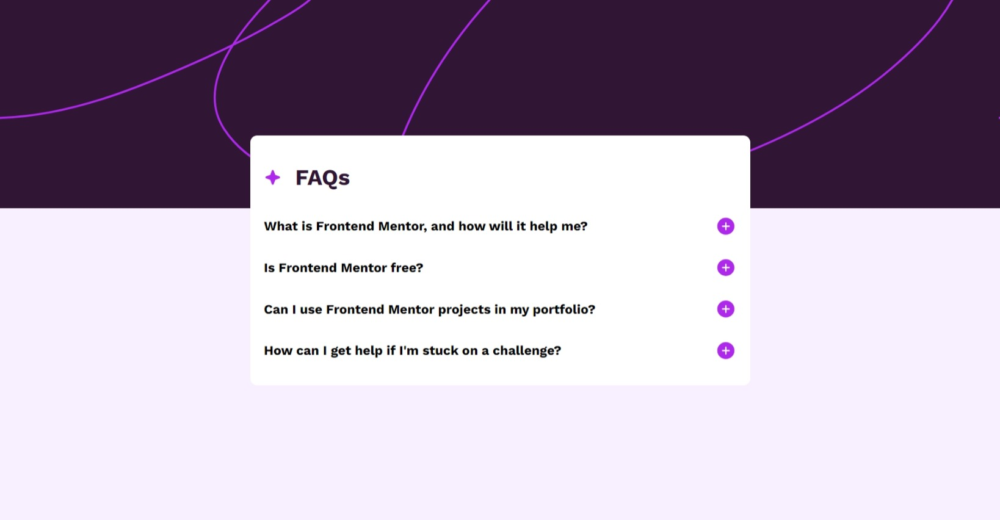

# Frontend Mentor - FAQ accordion (Only HTML & CSS)

## 1. Overview

The challenge is to build out this FAQ accordion and get it looking as close to the design as possible.
Users should be able to:
- Hide/Show the answer to a question when the question is clicked.
- Navigate the questions and hide/show answers using keyboard navigation alone.
- View the optimal layout for the interface depending on their device's screen size.
- See hover and focus states for all interactive elements on the page


### a) My screenshot



### b) Links

- Solution URL: [my source code here](https://github.com/hieutrantrong21520859MMCL21/FrontEndPractice_Intern_FAQ_Accordion)
- Live Site URL: [my website's URL here](https://hieutrantrong21520859mmcl21.github.io/FrontEndPractice_Intern_FAQ_Accordion/)

## 2. My process

### a) Built with

- Semantic HTML
- CSS
- Mobile - first workflow

### b) What I learned

- How to apply *click* effect using JavaScript.
- How to use some query methods in JavaScript.
- How to use *details* tag for toggle effect.
- How to display JSON data using JavaScript.
- Some codes I am most proud of (which consist of knowledge I have learned):

```css
.container ul details summary::after {
    content: url(./assets/images/icon-plus.svg);
}

.container ul details[open] summary::after{
    content: url(./assets/images/icon-minus.svg);
}
```

```javascript
let htmlText = "";

data.forEach(couple => {

    htmlText += `<li>

        <details>

          <summary class="question">

            <h4>
          
              ${couple.question}
    
            </h4>

          </summary>

          <p>

            ${couple.answer}  

          </p>

        </details>

      </li>`
})

display.innerHTML = htmlText;
```

### c) Useful resources

- [MDN - HTML](https://developer.mozilla.org/en-US/docs/Web/HTML): this helped me a lot about HTML via articles.
- [Learn HTML](https://web.dev/learn/html): this is an amazing website that provides lessons about HTML with examples.
- [MDN - CSS](https://developer.mozilla.org/en-US/docs/Web/CSS): this helped me well with CSS via articles.
- [Learn CSS](https://web.dev/learn/css): this is an amazing website that provides lessons about CSS with examples.
- [MDN - JavaScript](https://developer.mozilla.org/en-US/docs/Web/JavaScript): this website a lot of useful articles.
- [javascript.info](https://javascript.info/): this website provides lots of lessons and detailed explanation.